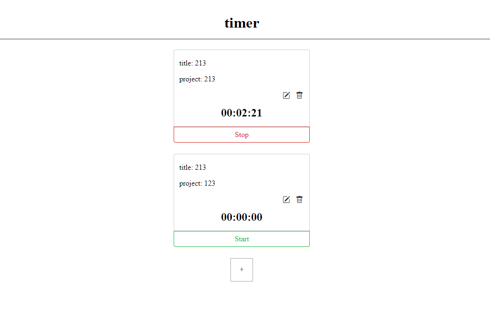

# 任务计时器



[在线演示（Live-Demo）](https://timer-tracking-app.herokuapp.com/): 使用heroku部署。

## 后端
使用express框架
- 提供静态文件
``` javascript
  app.use("/", express.static(path.join(__dirname, "public")));
```
- 使用fs模块保存数据
``` javascript
const DATA_FILE = path.join(__dirname, "data.json");

app.get("/api/timers", (req, res) => {
  fs.readFile(DATA_FILE, (err, data) => {
    res.json(JSON.parse(data));
  });
});
```

- 提供RESTFUL API
``` json

// timers 数据结构
[
  {
    "id": "d2d4bc3d-6a57-4a0f-84d6-4288c7e8f3ea",
    "title": "213",
    "project": "213",
    "elapsed": 23943,
    "runningSince": null
  },
  {
    "id": "277b577c-32d2-43f0-9d5a-518e193db73f",
    "title": "213",
    "project": "123",
    "elapsed": 0,
    "runningSince": null
  }
]
```
GET `/api/timers`: 获取所有timers
`api`
