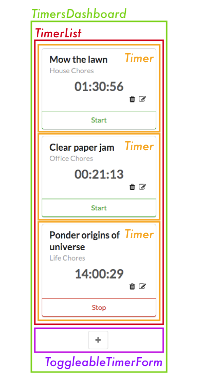
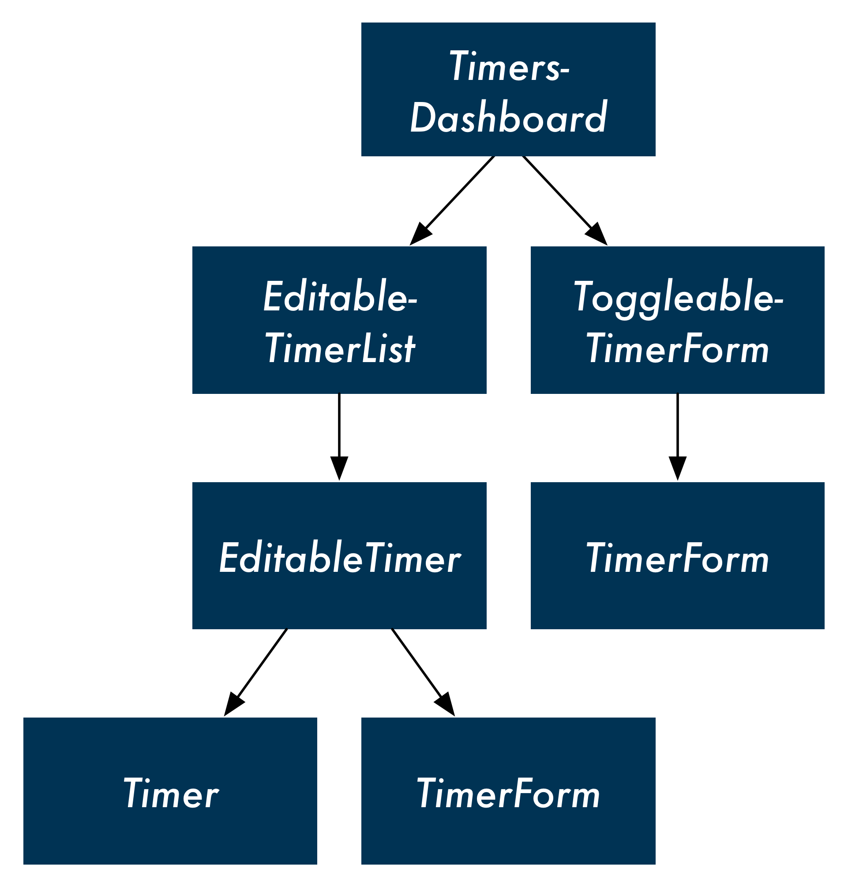

# 任务计时器


[在线演示（Live-Demo）](https://timer-tracking-app.herokuapp.com/): 使用heroku部署。

你可以创建一个任务, 添加title, project.
你可以随时开始计时, 刷新页面也不会影响计时,直到你点击结束计时.保存任务所耗费的时间.

## 后端
使用express框架
- 提供静态文件
``` javascript
  app.use("/", express.static(path.join(__dirname, "public")));
```
- 使用fs模块保存数据
``` javascript
const DATA_FILE = path.join(__dirname, "data.json");

app.get("/api/timers", (req, res) => {
  fs.readFile(DATA_FILE, (err, data) => {
    res.json(JSON.parse(data));
  });
});
```

- 提供RESTFUL API
``` json

// timers json结构
[
  {
    "id": "d2d4bc3d-6a57-4a0f-84d6-4288c7e8f3ea",
    "title": "213",
    "project": "213",
    "elapsed": 23943, // 累计时间
    "runningSince": null // 开始计时, 设为当前timestamp. 结束计时, 把此轮计时的时间加到elapsed, 然后设为null
  },
  {
    "id": "277b577c-32d2-43f0-9d5a-518e193db73f",
    "title": "213",
    "project": "123",
    "elapsed": 0,
    "runningSince": null
  }
]
```
- GET `/api/timers`: 获取所有timers
- POST `/api/timers`: 创建一个timer
- PUT `/api/timers`: 更新一个timer
- DELETE `/api/timers`: 删除一个timer
- POST `/api/timers/start`: 开始计时
- POST `/api/timers/stop`: 结束计时

## 前端
使用react, 主要以Class Component的方式组织代码.
没有使用构建工具, 直接在index.html中引入 `react`, `react-dom`, `babel(为了使用jsx)` 3个包.

### Thinking in React
- 状态管理
- 组件复用
- 生命周期




``` javascript
// Timer组件
// 需要维护一个时间状态, 这个状态每次更新需要根据prop来计算
static getDerivedStateFromProps(props, state) {
  const elapsed = props.runningSince? Date.now() - props.runningSince +props.elapsed : props.elapsed
  const newState = {
    elapsed
  }
  return newState
}
state = {
  elapsed: this.props.elapsed || 0,
}
```
